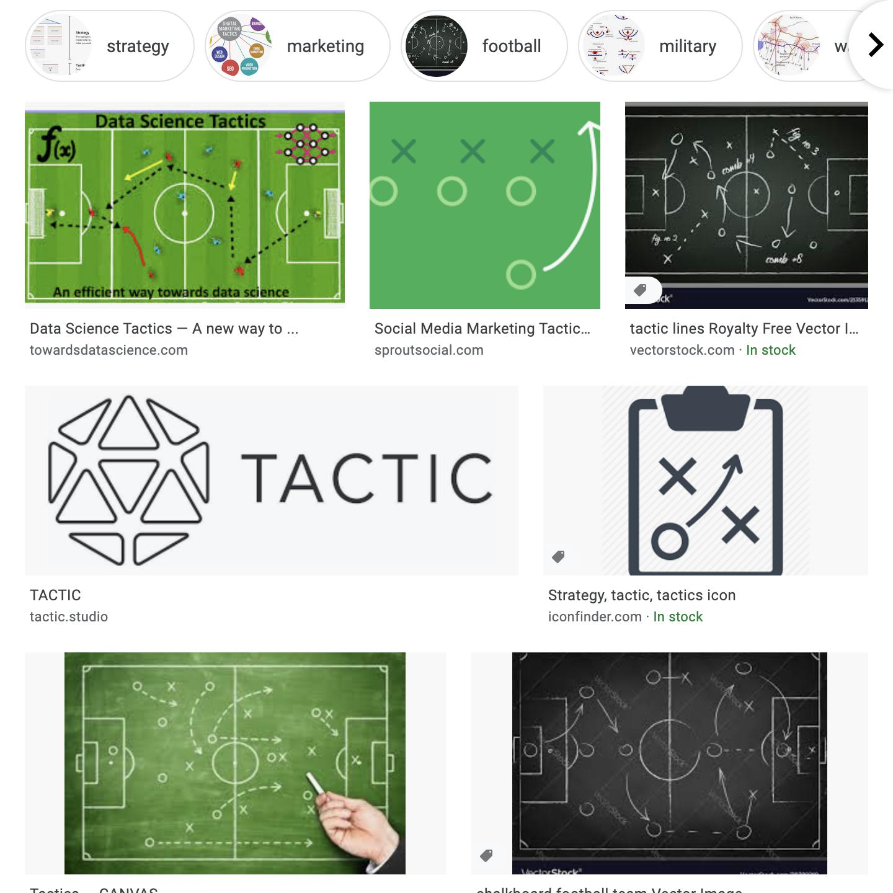
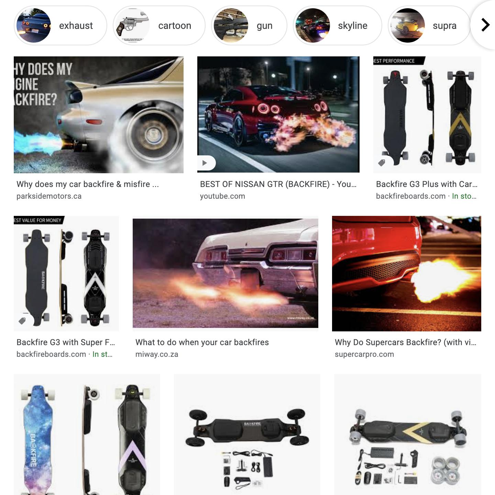
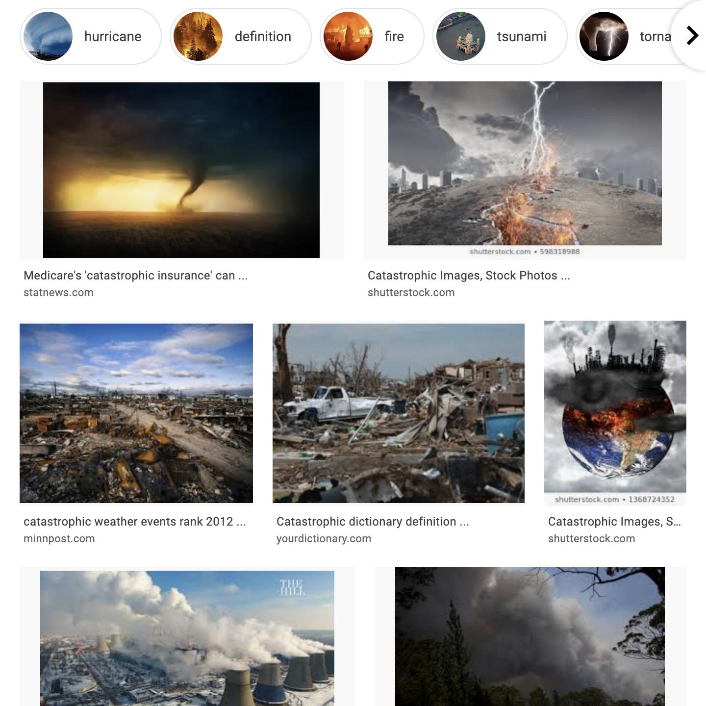
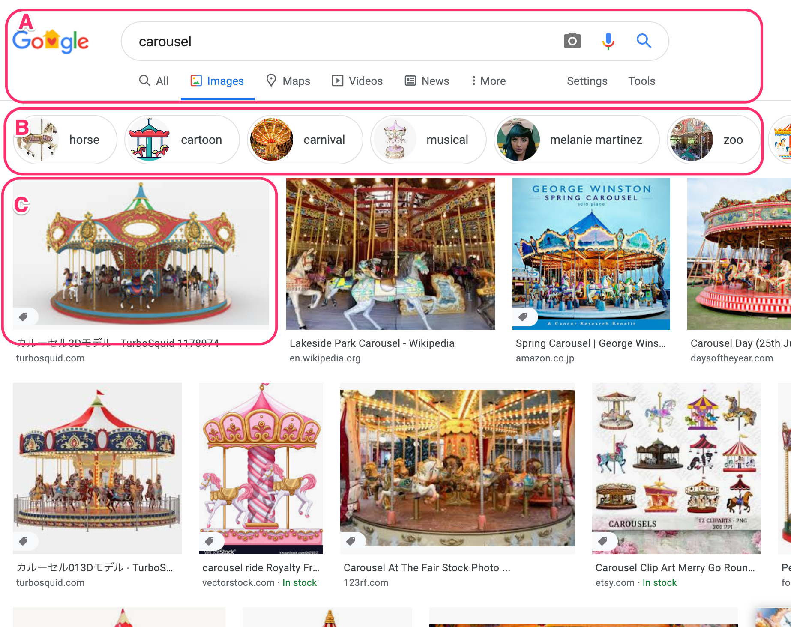
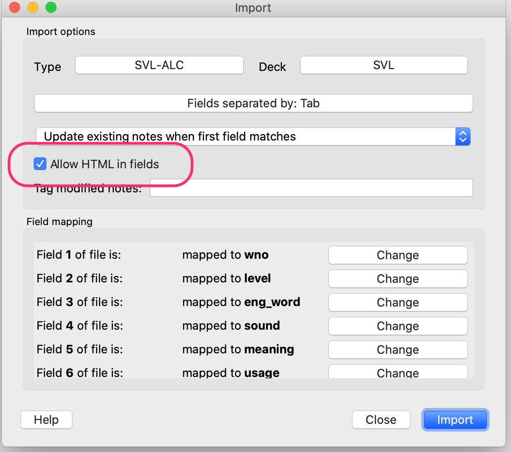

English README is [here](https://github.com/t9md/bulk-screen-capture/README-en.md).

<!-- TOC START min:1 max:3 link:true asterisk:true update:true -->
* [これは何？](#これは何)
* [最初に](#最初に)
* [前準備](#前準備)
* [使って行こう](#使って行こう)
  * [help を読もう](#help-を読もう)
  * [ファイルを与えて検索画面を一括キャプチャしよう](#ファイルを与えて検索画面を一括キャプチャしよう)
  * [Anki のデッキから画像を参照する](#anki-のデッキから画像を参照する)
    * [1. 保存した画像を Anki のメディアファイルに置く](#1-保存した画像を-anki-のメディアファイルに置く)
    * [2. フィールドから画像を参照する](#2-フィールドから画像を参照する)
    * [3. モバイルデバイスに同期する](#3-モバイルデバイスに同期する)
<!-- TOC END -->

# これは何？

bulk screen capture script intended to use for Anki.

- ファイルに書かれた、単語リストを読み取って、各単語を google イメージ検索で検索し、そのブラウザの画面毎キャプチャしファイルに保存するスクリプト。
- Anki で単語覚える時、イメージ検索は便利。が、いちいちリンクで飛ぶの面倒。あらかじめ全部の単語に画像設定しておきたい。でも1画像選ぶのもめんどいので、画像検索画面ごとキャプチャしよう。という狙いのスクリプト
- これは Anki のアドオンではありません。スクリプトで画像を一括収集し、スクリプトで tsvファイルを加工し、インポートすることで目的(全単語に画像検索結果のキャプチャ画像を追加)を達成します。

# 最初に

- 作者は macOS に元々入っている Python 2.7.16 で動作確認しました。
- Windows でも動くように出来るかも知れませんが、必要なら誰かやって下さい。
- Python 3系でも動くように出来るかも知れませんが、必要なら誰かやって下さい。
- 基本的に自分用なので細かいサポートはしません。自分で試行錯誤して頑張って下さい！

# 前準備

- Chrome Browser を自動操縦するためのドライバ [Chrome driver](http://chromedriver.chromium.org/downloads) をダウンロードして、 PATH の通ったとこ(`/usr/local/bin` とか)に置く。
Shell から `chromedriver -h` と打って、help が出たらOK

- selenium と pillow の install

```sh
$ pip install selenium pillow
```

# 使って行こう

## help を読もう


ヘルプを見て使えるオプションを確認。オプションを試行錯誤する場合は `--show` オプションでブラウザを表示しておくと便利

```sh
$ python bulk-screen-capture.py -h
```

## ファイルを与えて検索画面を一括キャプチャしよう

- このスクリプトは 1つ検索する毎に、1秒間 sleep します。これは一気に連続でやると、bot と見做されて、 Googleから弾かれるようになるためです。
- なので、1000単語なら 20分程度はかかります。パソコンがスリープしないようにするには、Amphetamine 等の、macを眠らせない常駐ソフトを利用すると良いです。

```python
python bulk-screen-capture.py -d collection.media -p "google-img--" -j before_scroll.js -w 720x720 sample.tsv
```

- `-d collection.media`: 保存先ディレクトリを指定
- `-p "google-img--"`: ファイル名につけるprefix。Ankiのメディアファイルはサブディレクトリに入れるとデバイス間で、同期されないので、メディアディレクトリ直下に置く必要あるので、見分けがつくように Prefix で目印をつけたい場合に使う。
- `-j before_scroll.js`: 保存前に呼ぶスクリプトのファイル名を指定。
- `-w 720x720`: スクリーンサイズ。大きくすると画像は綺麗だがサイズが大きくなる。
- `sample.tsv`: 最後に渡すのはファイル名。タブ区切りの最初のフィールドの単語を検索する。どうせ最初のフィールドしか使わないので、一行ずつ単語が書かれたファイルでも良い。

sample.tsv の中身(タブ区切り)
```
tactic	戦術、戦法、作戦
backfire	計画などが裏目に出る、エンジン・車がさか火を起こす
catastrophic	壊滅的な、大異変の、最悪の
```

以下は、それぞれ左から順に `tactic`, `backfire`, `catastrophic` の３つの画像。こういう画像が保存される。

<p>



</p>

デフォルトの `before_scroll.js` は何をしているか？

画面キャプチャを撮る前に良い感じの場所までスクロールさせている。

以下の検索結果の画像で説明する。
- `A`: この部分は邪魔。`B` あるいは `C` までスクロールしてから撮りたい
- `B`: この部分はその単語がどんな文脈で使われるかを知るのに便利
- `C`: しかし、検索語によっては `B` が出ない場合もある。その場合は `C`までスクロール

<p>

</p>

## Anki のデッキから画像を参照する

### 1. 保存した画像を Anki のメディアファイルに置く

置こう。置いていこう。
画像サイズは、720x720 で SVL10, 11, 12の合計3000ファイルの総合計は 572MBだった。
※ SVLは各レベル1000単語

### 2. フィールドから画像を参照する

サンプルとして [add_img_field.rb](https://github.com/t9md/bulk-screen-capture/blob/master/add_img_field.rb) を置いてある。これは、第一フィールドが検索単語の tsv を読み込んで、末尾に画像への参照(` sample-new.tsv
master github/bulk-screen-capture% cat sample-new.tsv
tactic  戦術、戦法、作戦        
backfire        計画などが裏目に出る、エンジン・車がさか火を起こす      
catastrophic    壊滅的な、大異変の、最悪の      
$
```

この tsv ファイルを読み込むときは、"Allow HTML in fields"を チェックすること

<p>

</p>


### 3. モバイルデバイスに同期する

同期しよう。していこう。
~~初回の同期は、画像が大量にある場合は同期に時間がかかるので、iTune のファイル転送で Anki に apkg を転送し、AnkiMoble から手動でインポートするのが速いかも。~~
